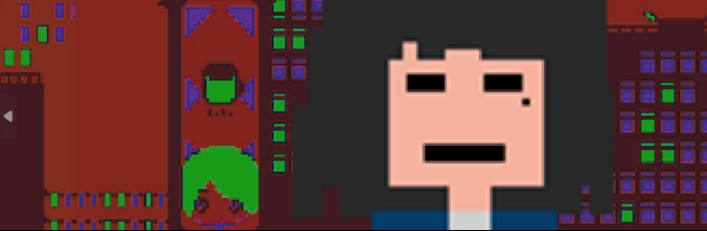
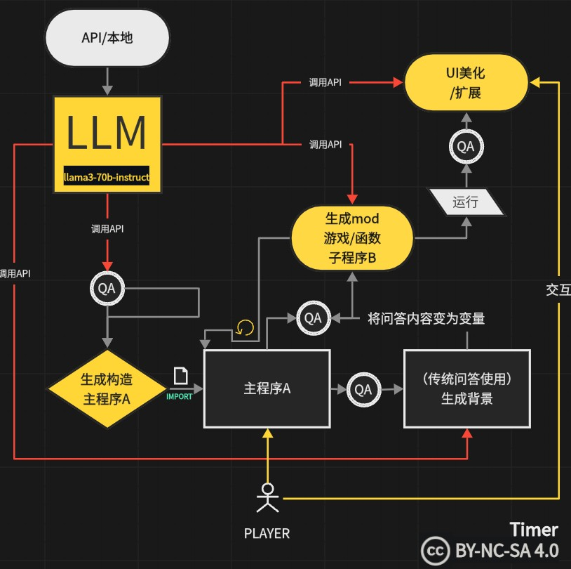

<h1 align="center">
  <br>
  <a href="https://www.bilibili.com/video/BV11S411c7SC/?share_source=copy_web&vd_source=0cac2b49e1352f96eceb28696ca78fa4"></a>
  <br>
    <a href="https://creativecommons.org/licenses/by-nc-sa/4.0/"></a>
</p>
  <strong style="font-weight: bold; font-size: 40px;">-WhoAreYou-</strong>
  <br>
</h1

<!---->

   **As usual, you're watching the morning light casting patterns on the desktop, slightly lost in thought, when your laptop chimes with a notification. With coffee in your left hand, you open the remote interview software by your bed. The programmer logs on for the interview and greets you...**

## Objective & System Architecture

* The main purpose of this demo is to test whether the program under this framework can have extensible, generative capabilities. Personally, I hope the LLM can foster the development of game architecture and creation, encouraging more developers to see that LLMs can be used not just in conversational settings but as a comprehensive mechanism in game programming. This approach allows for playing during development and lets players unconsciously expand the game itself.

<h1 align="center">
  <br>
    </a>
  <br>
</h1

* Unlike traditional game architectures, this game employs an LLM (Large Language Model) as its core engine.
  - [X] Utilize NVIDIA API for rapid inference computations.
  - [ ] Capable of autonomously constructing the main program for generation calls.
    - (Due to time constraints, this feature has been commented out in main.py after verification of functionality)
  - [X] Able to generate CMD interactive mini-games using the main program.
  - [X] Successfully enhanced the user interface of the generated mini-games by LLM.
  - [ ] Real-time generation of diverse voices through the interactive interface.
    - (Currently equipped with voice capabilities, but lacks real-time generation)
  - [ ] Integrate engine to elevate the gaming experience, transforming it into a true game.
    - (Perhaps one day)

## How To Use

> 首先你可以[在此下载](https://github.com/UNKNOWNTIMER/whoAreYou/archive/refs/heads/main.zip)压缩包  或  使用git到本地

```bash
# Clone this repository
$ git clone https://github.com/UNKNOWNTIMER/whoAreYou.git
```

> 然后运行requirements.bat自动配置环境   或   使用conda配置虚拟环境后

```python
# 到文件目录下使用pip配置环境
pip install -r requirements.txt
```

> 最后运行startGame  或  CMD端输入

```python
# 到文件目录下使用pip配置环境
py main.py
```

> ##### 提示

第一次启动会比较慢,请稍等片刻,待程序构建完成就能开始DEMO的运行

> ##### 操作方法

使用[ ↑ ]键[ ↓ ]键控制选择 [ ENTER ] 键进行确认

## Q&A

> ##### 我的程序打开后面试者没有背景内容？

如果提示调用程序通讯受限或者通讯报错,那么极大概率应该是我预提供的API调用次数消耗殆尽
请前往[NVIDIA](https://build.nvidia.com/meta/llama3-70b)点击Get API Key注册并免费获取密匙,最后将密匙复制到/api_key.txt文件中即可。

- 我不会收集任何密匙

> ##### 模型生成的游戏会有安全隐患么？

一般情况下是没有的,除非meta的llama3-70b-instruct开源模型在训练时出现安全漏洞或者NVIDIA对通讯过程做了什么手脚，以上情况都不太可能出现，所以你可以放心的使用。如果真提取到了病毒文件并出现安全问题，请务必前去寻找Meta或NVIDIA工程师。

- 我的程序只是一个架构构想而已。

## Credits

Thanks to NVIDIA for providing [free compute services](https://build.nvidia.com/meta/llama3-70b) and to Meta for their open-source models([llama3-70b-instruct](https://llama.meta.com/llama3/))
This software uses the following open source packages:

- [openai](https://pypi.org/project/openai/)
- [pillow](https://pypi.org/project/pillow/)
- [Pygame](https://pypi.org/project/pygame/)

## Related

[(CN)bilibili-web](https://www.bilibili.com/video/BV11S411c7SC/?share_source=copy_web&vd_source=0cac2b49e1352f96eceb28696ca78fa4) - 你能在这里找到中文版本的软件以及视频详细介绍

## You may also like...

<p align="center">
  <a href="https://zhenglinpan.github.io/AnitaDataset_homepage/">
    
  </a>
</p>

[Anita Dataset](https://github.com/zhenglinpan/AnitaDataset) is a cartoon animation dataset contributed by animators who share licensed, free and professional data for academic research purposes. It contains authentic hand-drawings(i.e. tie-downs, colored sketches) from modern animation industry. We hope this open-source dataset facilitate cartoon research in providing more effective cartoon solutions.

## References&support

If you find this app useful, please consider citing our work:

```bibtex
@misc{whoAreYou2024,
  title = {whoAreYou},
  howpublished = {https://github.com/UNKNOWNTIMER/whoAreYou},
  note = {Accessed: 2024-07-15}
}
```

if you liked using this app or it has helped you in any way, I'd like you send me an email at <zhuyu229065165@live.com> about anything you'd want to say about this software. I'd really appreciate it!

---

<p align="center">
  <a href="https://github.com/UNKNOWNTIMER">GitHub</a>  · 
  <a href="https://www.youtube.com/@unknowntimer6854">YouTube</a>  · 
  <a href="https://x.com/UNKNOWNTIMER0">X</a>
</p>
